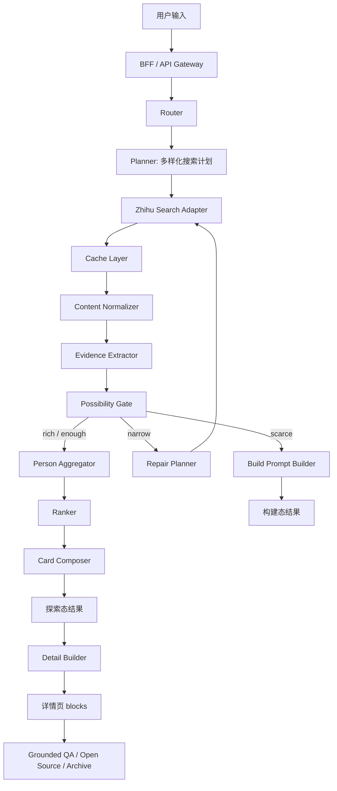

# 知乎黑客松后端框架设计与开发方案

版本：v0.1  
范围：仅后端框架设计与开发方案  
目标：48 小时内完成可运行、可对接前端、可接入知乎搜索 API 与 AI 模型 API 的后端 demo

---

## 1. 项目目标

本项目不是普通搜索，也不是让 AI 直接回答人生建议，而是基于知乎真实公开内容，把用户一个模糊的人生问题展开成多种真实的人、内容和可能性。

示例问题：

```text
不工作了能去哪儿？
```

系统需要返回：

- 不同可能路径，例如小城市生活、自由职业、Gap、失败复盘、重新就业、观点拆解；
- 每条路径背后的知乎作者或内容；
- 每张卡片对应的知乎原文证据；
- 可以继续追问、查看原文、存档；
- 如果内容不足，进入“构建态”，引导用户细化想找哪类人或哪类内容。

---

## 2. 后端设计原则

### 2.1 真实数据优先

知乎接口返回的真实字段应作为主要事实来源：

```text
Title
ContentType
ContentID
ContentText
Url
CommentCount
VoteUpCount
AuthorName
AuthorAvatar
AuthorBadge
AuthorBadgeText
EditTime
AuthorityLevel
RankingScore
```

其中 `ContentText` 是核心，所有经历判断、证据句、匹配点都应从 `ContentText` 抽取。

### 2.2 AI 不作为事实来源

AI 只做以下事情：

- 理解用户问题；
- 生成多样化搜索计划；
- 从真实内容中抽取证据；
- 判断内容类型和路径类型；
- 生成卡片文案；
- 基于公开内容回答追问。

AI 不允许：

- 编造作者经历；
- 推断作者真实身份；
- 把观点作者包装成亲历者；
- 生成无原文证据的“匹配理由”；
- 伪装成作者本人回复。

### 2.3 后端富字段，弱绑定 UI

前端方案尚未最终确定，因此接口应采用：

```text
sections / cards / blocks / actions / meta / ext
```

而不是绑定某一种具体页面结构。

### 2.4 API Key 预留

知乎搜索 API 和 AI 模型 API Key 先通过环境变量预留，当前开发阶段必须支持：

```text
mock 模式
cache_first 模式
real 模式
```

---

## 3. 推荐技术栈

48 小时黑客松建议选择轻量栈：

```text
Python 3.11+
FastAPI
Pydantic v2
httpx
SQLite 或本地 JSON cache
pytest
uvicorn
python-dotenv
```

理由：

- FastAPI 适合快速暴露接口；
- Pydantic 适合稳定接口契约；
- SQLite / JSON cache 足够支撑 demo；
- httpx 便于后续接入知乎 API 与模型 API。

---

## 4. 总体架构链路



---

## 5. 后端模块设计

### 5.1 BFF / API Gateway

职责：

- 提供统一 API；
- 创建 `match_id`；
- 管理请求上下文；
- 调用后端服务链路；
- 返回前端可消费结构。

P0 必须实现。

---

### 5.2 Router

职责：

- 判断用户问题是否适合进入“人物化可能性搜索”；
- 对非人生经验类问题做降级。

P0 可与 Planner 合并。

建议输出：

```json
{
  "route": "life_possibility_search",
  "need_search": true,
  "need_build_prompt": false
}
```

---

### 5.3 Planner

职责：

- 生成用户问题的展示改写；
- 生成多样化搜索计划；
- 提取需求画像。

是否需要 AI：需要。  
P0 必须实现，可先用 mock / prompt stub。

输入：

```json
{
  "raw_query": "不工作了能去哪儿？"
}
```

输出：

```json
{
  "display_query": "想看看那些离开工作轨道的人，后来去了哪里",
  "need_profile": {
    "scene": "离开工作轨道",
    "core_concerns": ["去哪里", "怎么生活", "收入来源", "是否后悔"],
    "expected_content": ["真实经历", "生活细节", "结果反馈"]
  },
  "search_plan": [
    {
      "path_hint": "小城生活",
      "query": "裸辞后去小城市生活 真实经历"
    },
    {
      "path_hint": "自由职业",
      "query": "离职后自由职业一年后怎么样"
    },
    {
      "path_hint": "Gap 过渡",
      "query": "裸辞 gap year 后来怎么样"
    },
    {
      "path_hint": "失败复盘",
      "query": "裸辞后后悔了 真实经历"
    },
    {
      "path_hint": "收入来源",
      "query": "不上班以后靠什么收入 亲身经历"
    }
  ]
}
```

---

### 5.4 Zhihu Search Adapter

职责：

- 统一封装知乎搜索 API；
- 支持 real / cache / mock 模式；
- 将 API 返回字段转为内部 `ContentItem`。

是否需要 AI：不需要。  
P0 必须实现。

环境变量预留：

```env
ZHIHU_SEARCH_API_URL=
ZHIHU_API_KEY=
ZHIHU_APP_ID=
ZHIHU_API_TIMEOUT=10
```

当前没有 API Key 时：

- 从本地 mock data 读取；
- 或从 cache 读取。

---

### 5.5 Cache Layer

职责：

- 缓存 query 结果；
- 缓存 content normalized 结果；
- 缓存 evidence extraction 结果；
- 保证现场 demo 不依赖接口稳定性。

P0 必须实现。

建议路径：

```text
/data/cache/search/{query_hash}.json
/data/cache/evidence/{content_id}.json
/data/mock/seed_contents.json
```

---

### 5.6 Content Normalizer

职责：

- 清洗知乎标题；
- 解析 URL 中的 question_id / answer_id；
- 生成 `person_key`；
- 去重；
- 将知乎字段转成内部模型。

是否需要 AI：不需要。

`person_key` 生成规则：

```text
person_key = sha256(AuthorName + AuthorAvatar)
```

内部结构：

```json
{
  "content_id": "4389112587059352534",
  "source": "zhihu",
  "content_type": "Answer",
  "title": "当下，你敢裸辞吗？",
  "content_text": "...",
  "url": "https://www.zhihu.com/question/654477796/answer/2037475407650349864",
  "question_id": "654477796",
  "answer_id": "2037475407650349864",
  "author": {
    "person_key": "hash_xxx",
    "display_name": "XMarco",
    "avatar": "https://...",
    "badge": "",
    "badge_text": ""
  },
  "stats": {
    "voteup_count": 0,
    "comment_count": 1,
    "authority_level": "1",
    "ranking_score": 2.1169436
  },
  "edit_time": 1778551991
}
```

---

### 5.7 Evidence Extractor

职责：

- 判断内容是否为真实经历；
- 抽取路径类型；
- 抽取匹配点；
- 抽取原文证据句；
- 判断是否可展示为人物卡。

是否需要 AI：需要。  
P0 必须实现，可先使用模型 stub。

输出：

```json
{
  "content_id": "4389112587059352534",
  "experience_type": "observational_advice",
  "first_person_experience": false,
  "path_type": "裸辞风险分析",
  "matched_points": [
    "讨论裸辞后的方向感缺失",
    "提到空窗期的现实成本",
    "强调不上班后需要重建时间结构"
  ],
  "evidence_quotes": [
    {
      "label": "方向感",
      "quote": "真正让他们在裸辞后感到崩溃的，不是钱先花完了，而是不知道接下来要干什么。"
    }
  ],
  "can_show_as_person_card": true,
  "can_show_as_life_story": false
}
```

经历类型枚举：

```text
first_person_story
observational_advice
professional_insight
generic_opinion
```

---

### 5.8 Possibility Gate

职责：

- 判断结果是否足够丰富；
- 判断路径是否多样；
- 判断是否需要补搜；
- 判断是否进入构建态。

是否需要 AI：规则为主，AI 辅助。  
P0 必须实现规则版。

状态定义：

```text
rich：内容丰富，路径多样
enough：内容够用，路径有限
narrow：内容相关但单一，需要补搜
scarce：内容少或证据不足，进入构建态
```

建议阈值：

```text
rich:
- 有效内容 >= 12
- 有效作者 >= 5
- 路径类型 >= 4
- 第一人称经历 >= 2
- 证据句 >= 10

enough:
- 有效内容 >= 6
- 有效作者 >= 3
- 路径类型 >= 2
- 证据句 >= 5

narrow:
- 有效内容够，但路径类型 < 2
- 或结果集中在单一观点

scarce:
- 有效内容 < 5
- 或有效作者 < 2
- 或证据句很少
```

输出：

```json
{
  "status": "narrow",
  "valid_content_count": 8,
  "valid_person_count": 4,
  "path_type_count": 1,
  "first_person_story_count": 1,
  "evidence_quote_count": 7,
  "missing_path_types": ["失败复盘", "小城生活", "收入来源"],
  "action": "repair_search"
}
```

---

### 5.9 Repair Planner

职责：

- 只在 `narrow` 状态触发；
- 最多补搜一轮；
- 根据缺失路径生成补充 query。

是否需要 AI：可用 AI，也可以规则模板生成。  
P0 可做轻版。

输出：

```json
{
  "repair_queries": [
    "裸辞后后悔了 真实经历",
    "离职后去小城市生活 后悔吗",
    "不上班以后靠什么收入 亲身经历"
  ]
}
```

---

### 5.10 Build Prompt Builder

职责：

- 当结果 `scarce` 时进入构建态；
- 生成用户可点击的细化选项。

是否需要 AI：不需要，P0 可模板生成。

输出：

```json
{
  "title": "你更想找到哪类人？",
  "options": [
    {
      "label": "真的裸辞过的人",
      "query_patch": "我 裸辞 后 真实经历"
    },
    {
      "label": "去了小城市的人",
      "query_patch": "裸辞后 去小城市 生活"
    },
    {
      "label": "靠自由职业活下来的人",
      "query_patch": "不上班 自由职业 收入 真实经历"
    },
    {
      "label": "后来后悔的人",
      "query_patch": "裸辞 后悔 真实经历"
    }
  ]
}
```

---

### 5.11 Person Aggregator

职责：

- 按 `person_key` 聚合内容；
- 合并证据和标签；
- 生成候选作者 / 人物。

是否需要 AI：不需要。

---

### 5.12 Ranker

职责：

- 按相关性、证据强度、多样性排序；
- P0 使用规则即可。

建议分数：

```text
score =
0.30 * ranking_score
+ 0.25 * evidence_strength
+ 0.20 * path_diversity_bonus
+ 0.10 * first_person_bonus
+ 0.05 * authority_level
+ 0.05 * freshness
+ 0.05 * engagement
```

---

### 5.13 Card Composer

职责：

- 生成前端卡片字段；
- 区分人物卡、观点作者卡、内容卡；
- 保持文案克制，避免 AI 味。

是否需要 AI：需要，但可模板化。  
P0 必须实现。

卡片类型：

```text
person_story_card
insight_author_card
content_card
```

---

### 5.14 Detail Builder

职责：

- 根据 card_id 生成详情页；
- 采用 blocks 结构，弱绑定 UI。

是否需要 AI：可用 AI 生成摘要，也可模板生成。  
P0 必须实现。

---

### 5.15 Grounded QA

职责：

- 基于该卡片关联的 ContentText 和 evidence_quotes 回答用户追问；
- 不允许脱离证据。

是否需要 AI：需要。  
P0 可做轻版。

---

### 5.16 Archive Service

职责：

- 存档卡片；
- 支持查询已存档内容。

是否需要 AI：不需要。  
P0 可用 SQLite 或内存存储。

---

## 6. API 设计

### 6.1 健康检查

```http
GET /api/v1/health
```

返回：

```json
{
  "status": "ok",
  "version": "v0.1"
}
```

---

### 6.2 查询入口

```http
POST /api/v1/match/query
```

请求：

```json
{
  "query": "不工作了能去哪儿？",
  "session_id": "s_001",
  "mode": "cache_first"
}
```

返回结构：

```json
{
  "schema_version": "v0.1",
  "match_id": "m_001",
  "query_view": {
    "raw_query": "不工作了能去哪儿？",
    "display_query": "想看看那些离开工作轨道的人，后来去了哪里",
    "guide_text": "这些内容不一定给你标准答案，但它们来自真实的公开表达。"
  },
  "possibility": {
    "status": "rich",
    "path_count": 4,
    "message": "这个问题下面，找到了几种不同的真实走法。"
  },
  "sections": [],
  "meta": {
    "data_mode": "cache_first",
    "source": "zhihu"
  },
  "debug": {}
}
```

---

### 6.3 获取 match 结果

```http
GET /api/v1/match/{match_id}
```

用于前端刷新或二次读取。

---

### 6.4 获取卡片详情

```http
GET /api/v1/cards/{card_id}/detail
```

返回：

```json
{
  "detail_id": "detail_001",
  "card_id": "card_001",
  "title": "这条公开表达为什么和你有关",
  "blocks": [
    {
      "block_type": "relation_summary",
      "title": "和你的问题有关的地方",
      "content": "这条回答讨论了离开工作结构后，方向感、收入和生活节奏的问题。"
    },
    {
      "block_type": "evidence_quote",
      "title": "原文片段",
      "quote": "裸辞之后，这个结构没了，你要自己构建。",
      "source_content_id": "4389112587059352534"
    }
  ],
  "actions": []
}
```

---

### 6.5 基于公开内容追问

```http
POST /api/v1/cards/{card_id}/ask
```

请求：

```json
{
  "question": "他最担心的是什么？"
}
```

返回：

```json
{
  "answer_type": "content_grounded",
  "answer": "从这条公开回答看，作者主要提醒的是：裸辞后真正困难的不只是钱，而是方向感和时间结构。",
  "evidence": [
    {
      "quote": "裸辞之后，这个结构没了，你要自己构建。",
      "content_id": "4389112587059352534"
    }
  ],
  "suggested_next_questions": [
    "裸辞前应该准备什么？",
    "不上班后如何安排每天？"
  ]
}
```

---

### 6.6 存档

```http
POST /api/v1/archive
```

请求：

```json
{
  "card_id": "card_001",
  "match_id": "m_001",
  "note": "这个路径可以继续看"
}
```

返回：

```json
{
  "archive_id": "a_001",
  "status": "saved"
}
```

---

## 7. 目录结构建议

```text
backend/
  app/
    main.py
    config.py
    api/
      routes_health.py
      routes_match.py
      routes_cards.py
      routes_archive.py
    models/
      schemas.py
      domain.py
    services/
      router_service.py
      planner_service.py
      zhihu_adapter.py
      cache_service.py
      normalizer.py
      evidence_extractor.py
      possibility_gate.py
      repair_planner.py
      build_prompt_builder.py
      person_aggregator.py
      ranker.py
      card_composer.py
      detail_builder.py
      grounded_qa.py
      archive_service.py
    clients/
      llm_client.py
      zhihu_client.py
    data/
      mock/
        seed_contents.json
      cache/
    utils/
      hashing.py
      text.py
      time.py
  tests/
    test_match_query.py
    test_possibility_gate.py
    test_normalizer.py
  requirements.txt
  README.md
  .env.example
```

---

## 8. 环境变量设计

```env
APP_ENV=dev
DATA_MODE=mock
ENABLE_LLM=false

# Zhihu API placeholders
ZHIHU_SEARCH_API_URL=
ZHIHU_API_KEY=
ZHIHU_APP_ID=
ZHIHU_API_TIMEOUT=10

# LLM placeholders
LLM_API_KEY=
LLM_BASE_URL=
LLM_MODEL=
LLM_TIMEOUT=20

# Cache
CACHE_DIR=app/data/cache
MOCK_DATA_PATH=app/data/mock/seed_contents.json

# Server
HOST=0.0.0.0
PORT=8000
```

`DATA_MODE` 取值：

```text
mock：只读 mock 数据
cache_first：先读缓存，未命中再尝试真实 API
real：优先调真实 API，失败后降级缓存 / mock
```

---

## 9. Token 消耗控制

P0 策略：

```text
1. Planner 每次查询调用 1 次。
2. 搜索最多 5 个 query。
3. 每个 query 最多取 Top 10。
4. 合并去重后 Evidence Extractor 最多处理 Top 20。
5. Evidence Extractor 只输出 JSON，不写长文。
6. Possibility Gate 规则计算为主。
7. Repair Planner 最多触发 1 次。
8. Card Composer 只处理最终 Top cards。
9. Grounded QA 只在用户点击追问时触发。
```

没有 LLM Key 时，所有 AI 节点必须可用 stub 返回。

---

## 10. 48 小时开发计划

### 0-6 小时

- 搭 FastAPI 项目；
- 定义 Pydantic schema；
- 实现 mock 数据；
- 实现 `/health`、`/match/query` mock 返回；
- 产出 `.env.example`。

验收：前端可通过 mock 接口拿到 sections / cards。

### 6-12 小时

- 实现 Zhihu Adapter 占位；
- 实现 Cache Layer；
- 实现 Normalizer；
- 支持 `DATA_MODE=mock/cache_first/real`；
- 准备 3 个 demo query 的 seed 数据。

验收：后端能返回真实格式的内容卡。

### 12-24 小时

- 实现 Planner stub / LLM client 占位；
- 实现 Evidence Extractor stub / LLM prompt 占位；
- 实现 Possibility Gate 规则版；
- 实现 Person Aggregator；
- 实现 Ranker。

验收：查询结果可形成可能性地图和卡片。

### 24-36 小时

- 实现 Card Composer；
- 实现 Detail Builder；
- 实现 Archive；
- 实现 Grounded QA stub；
- 实现 Repair Planner 轻版。

验收：完整闭环可跑：查询 → 卡片 → 详情 → 追问 → 存档。

### 36-48 小时

- 加错误兜底；
- 加接口日志；
- 固化演示数据；
- 写 README；
- 补测试；
- 调整返回字段稳定性。

验收：无需真实 Key 也能完整演示；补充 Key 后可走真实 API。

---

## 11. 风险与降级

| 风险 | 降级方案 |
|---|---|
| 知乎 API 未接入 | mock / cache 数据完整跑通 |
| API 不稳定 | cache_first |
| 没有 LLM Key | stub AI 服务 |
| 内容结果太少 | 构建态 |
| 内容结果单一 | Repair Search 一轮 |
| 没有 AuthorID | AuthorName + AuthorAvatar hash |
| AI 生成过度 | evidence-first，所有卡片必须绑定 quote |
| 追问质量不稳定 | 只基于 evidence_quotes 回答 |

---

## 12. P0 验收标准

后端 P0 成功标准：

```text
1. POST /api/v1/match/query 可返回探索态或构建态。
2. 返回中包含 sections / cards / actions。
3. 每张卡包含作者、头像、一句话、标签、证据、原文链接。
4. Possibility Gate 可输出 rich / enough / narrow / scarce。
5. narrow 可补搜一轮。
6. scarce 可返回 build_prompt。
7. GET card detail 可返回 blocks。
8. POST ask 可返回基于证据的回答。
9. POST archive 可保存卡片。
10. 无知乎 API Key、无 LLM Key 时仍能通过 mock 完整跑通。
```

---

## 13. 最终建议

48 小时内只做后端框架时，核心不是追求模型效果，而是保证架构可插拔：

```text
知乎 API 可插拔
LLM API 可插拔
mock / cache / real 模式可切换
sections / cards / blocks 可供前端灵活消费
Possibility Gate 能体现产品差异
```

后续你补充知乎搜索 API 和模型 API Key 后，只需要替换 `zhihu_client.py` 和 `llm_client.py`，不需要重构主链路。
